# EsploraLittleGame
 Der Versuch ein kleines Spiel zu entwickeln. Von einem Bewegten Punkt bis zum bewegen innerhalb in einer Karte.

## Suries Fotos

Ein kleines Adventure für den **Arduino Esplora** mit dem Arduino TFT-Display. Finde den Schlüssel, öffne die Tür und hilf der Händlerin Surie: Sie wünscht sich ein Foto von Baum und Haus im Garten.

Danach geht es weiter, denn Surie möchte noch drei Fotos:
- **Brücke:** über den Fluss hinter dem Garten
- **Insel:** mit dem Schiff zur Nachbarinsel, die Fahrt ist als Seekarte animiert
- **Stadt:** mit dem Bus zum Stadtrand

Zum Schluss hängen die Fotos in Suries Stube, und es gibt einen Kaffee.

| Start | Garten | Händlerin | Geschafft |
|---|---|---|---|
| 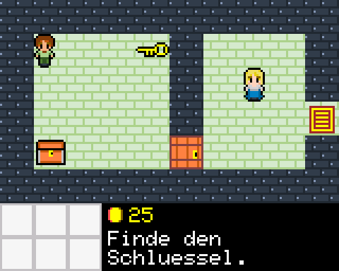 | 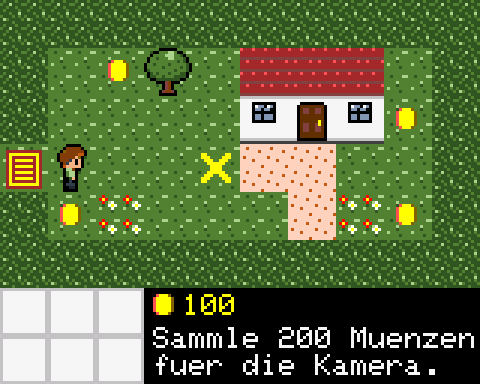 | 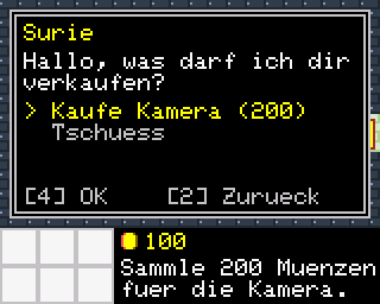 | 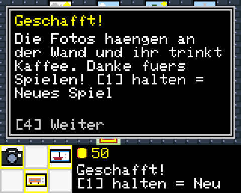 |

| Fluss | Hafen | Seekarte | Nachbarinsel |
|---|---|---|---|
| 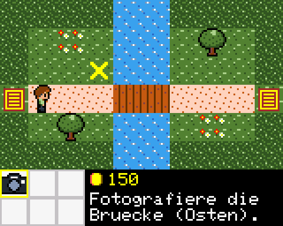 | 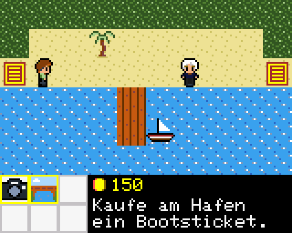 | 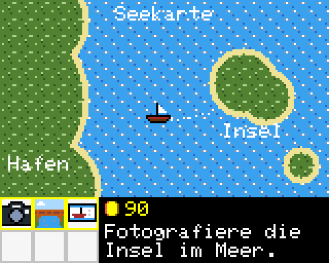 | 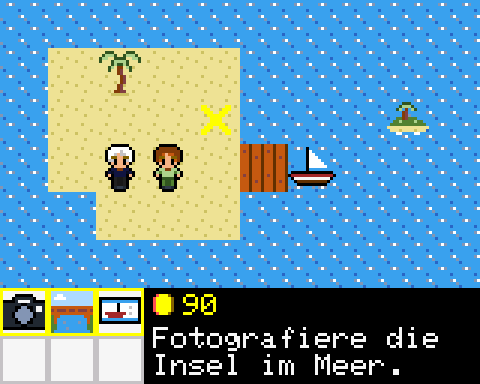 |

| Busfahrt | Stadtrand | Suries Stube |
|---|---|---|
| 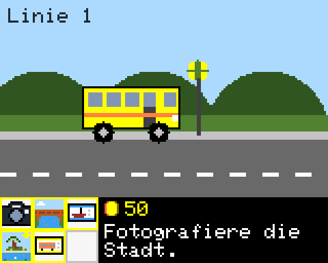 | 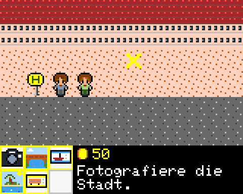 | 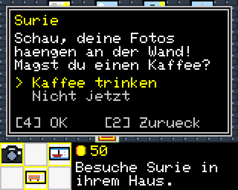 |

### Steuerung

| Eingabe | Funktion |
|---|---|
| Joystick | Laufen, im Fenster die Auswahl wechseln |
| Button 4 (rechts) | Bestätigen / Weiter |
| Button 2 (links) | Fenster schließen / Zurück |
| Button 1 (unten) 1 s halten | Neues Spiel |

Aktionen lösen durch Anstoßen aus (Tür, Kiste, Surie) oder durch Betreten (Schlüssel, Münzen, Ausgang, Fotopunkt).

### Übersetzen

In der Arduino IDE als Board **Arduino Esplora** wählen, die Bibliotheken `TFT` und `Esplora` installieren und `EsploraLittleGame.ino` hochladen.

### Aufbau

| Datei | Inhalt |
|---|---|
| `EsploraLittleGame.ino` | Konstanten, gemeinsamer Spielstand, `setup()`, `loop()`, Eingaben |
| `AssetsData.ino` | Kacheln, Icons und Schiff, erzeugt von `tools/sprites.py` |
| `TravelComponent.ino` | Kapitän, Busfahrer, Seekarten- und Bus-Animation |
| `RenderComponent.ino` | Farbpalette und flackerfreies Zeichnen per `setAddrWindow` + `pushColor` |
| `MapComponent.ino` | Karten, Kachel-Texturen, Kartenwechsel |
| `CollisionComponent.ino` | Kollision, Anstoßen und Betreten |
| `FigureComponent.ino` | Figur-Sprites und Laufanimation |
| `BackpackComponent.ino` | Gegenstände und Rucksack |
| `TraderComponent.ino` | Händlerin Surie, Kiste, Münzen |
| `WindowComponent.ino` | Dialogfenster mit Zeilenumbruch und Auswahl |
| `QuestComponent.ino` | Spielablauf und Zielanzeige |

### Werkzeuge

- `tools/sprites.py`: Kacheln als lesbare Zeichengrafik pflegen und daraus die `PROGMEM`-Arrays erzeugen.
- `tools/simulator/`: Das Spiel am PC testen, ohne Hardware. Der Simulator spielt das Spiel einmal komplett durch, prüft den Spielstand und legt Bildschirmfotos in `tools/simulator/out/` ab:

  ```
  python3 tools/simulator/build.py <Pfad zur TFT Bibliothek>
  ```

### Dokumentation

- [Anforderungsbeschreibung](docs/Anforderungen.md)
- [Code-Review des ursprünglichen Standes](docs/Code-Review.md)
