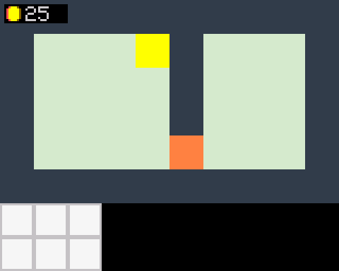

# Code-Review des ursprünglichen Standes (Commit `8e88af8`, „Clean up“)

Geprüft wurden alle acht `.ino`-Dateien. Die Messungen stammen aus dem PC-Simulator (`tools/simulator`), der den Code mit nachgebildetem Display und Esplora ausführt.

*Ursprünglicher Stand direkt nach dem Start: Kacheln sind einfarbige Blöcke, Spielfigur und Händlerin fehlen, die Münzanzeige liegt über der Wand.*

## Was das Spiel konnte

- Figur mit Laufanimation in vier Richtungen auf einer 10×6-Kachelkarte bewegen
- Schlüssel (gelber Block) aufheben, er erscheint im Rucksack
- Tür (oranger Block) mit dem Schlüssel öffnen, der Schlüssel wird verbraucht
- Beim Berühren der Händlerin Surie erscheint ein Fenster „Hallo!“, das mit Button 2 geschlossen wird
- Bereits angelegt, aber noch nicht genutzt: Kamera, Foto, Kiste, Münzen, Handelstexte, männliche Händlerfigur

## Gefundene Fehler

| # | Datei | Problem | Auswirkung |
|---|---|---|---|
| 1 | Render/Map | Pro Pixel-Schritt werden bis zu 9 Kacheln mit `fillRect` gelöscht und danach die Figur Pixel für Pixel mit `drawPixel` gezeichnet. | Die Figur **flackert**. Ca. 6.000 SPI-Bytes pro Schritt, das Spiel läuft langsam. |
| 2 | Figure | `drawFigure` zeichnet bei Richtung (0,0) nichts. `loop()` setzt die Richtung in jedem Durchlauf auf 0 zurück. | Die **Figur ist beim Start unsichtbar** und erscheint erst bei Bewegung. |
| 3 | Trader/Map | Surie wird nur gezeichnet, wenn `mMapFigureRerender` gesetzt ist, und das passiert erst über `drawStack()` bei Bewegung. | **Surie ist beim Start unsichtbar.** |
| 4 | Collision | `checkCollideNeighbor` liest die Rohkarte (Kachel 2) ohne `mMapKeyIsGet`. Nachdem die Tür geöffnet wurde, ist der Schlüssel nicht mehr im Rucksack. | Der **Schlüssel lässt sich erneut aufheben**, obwohl er auf der Karte nicht mehr zu sehen ist. |
| 5 | Backpack | `getItemToUsed` entfernt den Schlüssel aus `mBackPlaces`, zeichnet den Taschenplatz aber nicht neu. | Das Schlüssel-Icon bleibt sichtbar. |
| 6 | Main | Reset mit Button 1 leert den Rucksack nicht. Außerdem löst der Reset in jedem Durchlauf aus, solange der Button gedrückt ist. | Der Zustand ist danach widersprüchlich: Die Tür öffnet sich, obwohl der Schlüssel noch auf der Karte liegt und nicht aufgehoben werden kann. |
| 7 | Main | `if(!mMenueNavigation && a != b \|\| c != d)`: `&&` bindet stärker als `\|\|`. | Die Menü-Sperre gilt nur für die X-Achse. |
| 8 | Figure | `mGameTime % 4 > 0` schaltet die Animation in 3 von 4 Durchläufen weiter. | Die Animation ist unruhig und von der Schleifendauer abhängig. |
| 9 | Collision | Kamera (3) und Foto (4) werden bei `resultColide == true` aufgenommen, also gerade dann, wenn **keine** Überschneidung besteht. | Beide Gegenstände würden schon von der Nachbarkachel aus aufgenommen (sie sind aktuell nicht auf der Karte). |
| 10 | Map/Trader | Die Kiste (Kachel 7) fällt in `renderMapTile` auf `default` (Boden). `drawBox` wird nie aufgerufen. | Die Kiste ist unsichtbar und hat keine Funktion. |
| 11 | Window/Collision | `mShowWindow` wird bei jeder Kollisionsprüfung neu gesetzt. Beim Schließen wird die Figur ohne Kollisionsprüfung 1 px nach unten geschoben (`mLastPosY++`). | Die Figur kann in eine Wand geschoben werden. Das Fenster zeigt immer nur „Hallo!“. |
| 12 | Backpack/Trader | `char mItemKey01[10] = "Schluessel"` (ebenso Kamera, Foto und Beschreibungen): Im Array ist kein Platz für das abschließende `\0`. | Die Texte sind nicht terminiert, sobald sie ausgegeben werden. |
| 13 | Main | `byte mMapFigurePositionX = -1` | Der Wert ist tatsächlich 255. |
| 14 | Render | `writeValue` nutzt die `String`-Klasse. | Der Heap wird bei nur 2,5 KB SRAM fragmentiert. |
| 15 | Speicher | `mTempIcon[256]` und `mTempArray[160]` sind reine Zwischenpuffer. | 416 Byte (16 %) des SRAM sind dauerhaft belegt. |
| 16 | Trader | `memCopyItems` prüft `== 128`, die übrigen Bits aber mit `>=`. `mTraderName[1]` und `mTraderdescription[1]` sind ungenutzt. | Die Logik ist uneinheitlich, es gibt toten Code. |
| 17 | Main | Die Totzone des Joysticks ist 5 bei einem Wertebereich von ±512. | Die Figur reagiert sehr empfindlich auf Rauschen. |

## Was im neuen Stand geändert wurde

- **Rendering** (Fehler 1–3, 8, 10, 15): Jeder Pixel wird aus den Ebenen Karte, Surie und Figur zusammengesetzt, nach Tiefe sortiert, und per `setAddrWindow` + `pushColor` in einem Rutsch gesendet. Das Ergebnis:
  - kein Flackern mehr
  - ca. 380 statt ca. 6.000 SPI-Bytes pro Schritt, also etwa 16-mal weniger
  - Sprites werden direkt aus dem Flash gelesen, der SRAM-Bedarf sinkt von 773 auf ca. 370 Byte
- **Zustand der Karte** (Fehler 4, 5, 6): Aufgesammelte Dinge, geöffnete Türen und die geleerte Kiste merkt sich ein Bitfeld pro Karte (`mTileConsumed`). `resetGame()` setzt alles zurück, auch den Rucksack. Für den Reset muss Button 1 eine Sekunde gehalten werden.
- **Kollision** (Fehler 7, 9, 11): Geprüft wird ein Fuß-Bereich der Figur. Anstoßen und Betreten sind getrennt, und Sperren (`mBumpLatch`, `mTriggerLatch`) verhindern, dass etwas mehrfach auslöst. Die Figur wird nie mehr ohne Prüfung verschoben.
- **Texte** (Fehler 12, 14): Alle Texte liegen als `const PROGMEM char name[] = "…"` im Flash, Zahlen werden mit `itoa` geschrieben.
